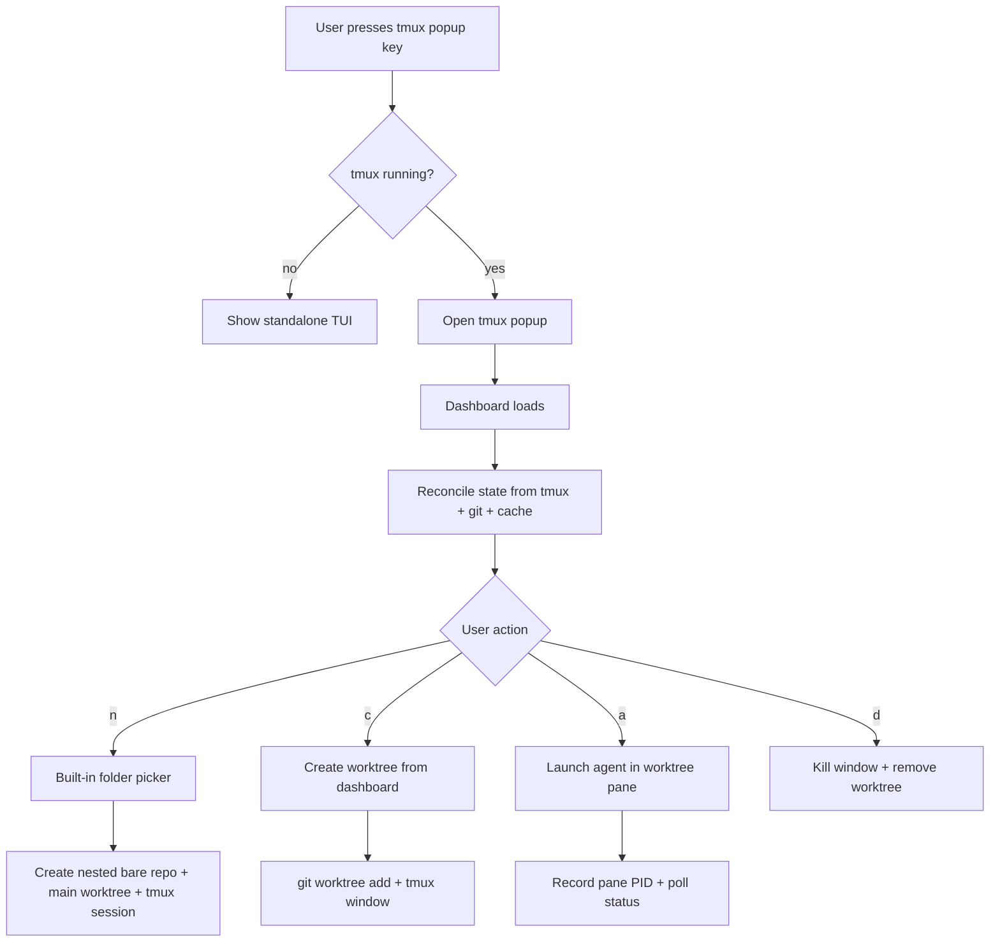
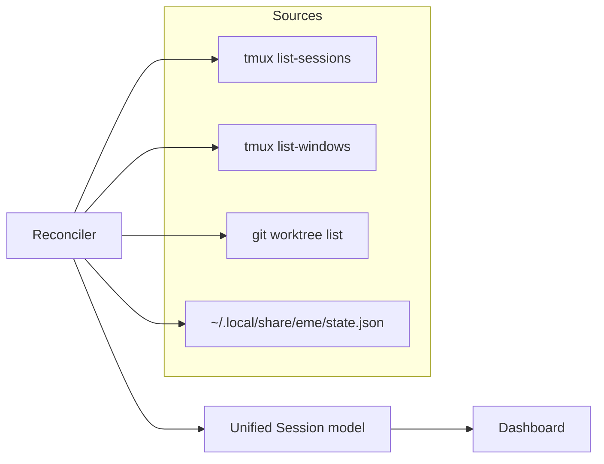
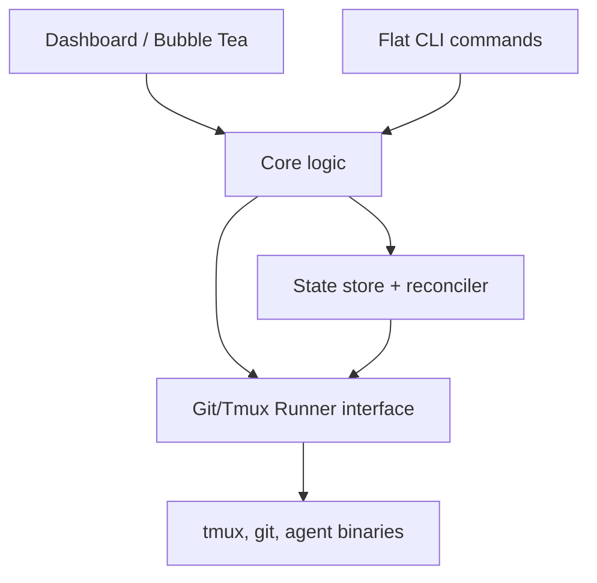

# ADR-001: eme Architecture

**Status:** Accepted  
**Date:** 2026-06-19

## Context

`eme` is a terminal tool for developers who run AI coding agents across multiple git worktrees. It does not try to be a general tmux session manager. The design started from a PRD and was refined by a DX review and an engineering review.

Key constraints that shaped this architecture:

- Users live in tmux and want a vim-like modal interface.
- Each AI agent instance should be tied to a git worktree.
- First-time setup must be minimal: install, bind a tmux popup key, start using.
- The tool must tolerate manual tmux/git changes outside of eme.
- The code must be testable without requiring tmux or git in CI.

## Decisions

### 1. User model: `folder = project = tmux session`

A folder is the project. The tmux session name is derived from it. There is no explicit `project add` registration.

- Session display name: folder basename.
- Session internal ID: a stable, unique identifier that avoids collisions when two folders share a basename (see Decision 8).

### 2. Worktree layout: nested bare repository

When a folder is selected in `eme new`, eme creates a nested bare repository:

```text
<folder>/
  .bare/          # bare git repository
  main/           # linked worktree for the default branch
  feature-foo/    # additional linked worktree
```

Rationale:

- Keeps all worktrees under one project folder, which matches the mental model.
- Makes worktree creation cheap: `git worktree add ../<name>`.
- Makes worktree removal cheap and safe: delete the linked directory and prune.

Guardrail: if the selected folder already contains a `.git` directory or file, eme refuses to convert it and explains how to use an empty parent folder instead. An explicit "adopt existing repo" path is out of scope for v0.1.

### 3. CLI surface is flat

```text
eme              # dashboard
eme new          # fuzzy folder picker → new project
eme switch <id>  # switch to session/window
eme kill <id>    # remove worktree + kill tmux window
eme agent <id>   # start/stop/toggle agent
eme doctor       # verify environment
eme --version
```

Legacy `project`/`worktree` subcommands from the PRD are removed. The flat surface is easier to type and script.

### 4. State synchronization is hybrid

`eme` caches metadata in `~/.local/share/eme/state.json` but reconciles it with live state on every run:

- `tmux list-sessions`
- `tmux list-windows`
- `git worktree list`

Only sessions, windows, and worktrees that actually exist are shown. Metadata that live tools cannot provide (last used agent, per-worktree overrides) is preserved in the cache.

A single-invocation cache (1 second TTL) avoids redundant `tmux`/`git` list calls while drawing the dashboard or running a command.

### 5. Multi-agent status monitoring is a first-class feature

eme's core job is to show, across every worktree, which agent is `idle`, `working`, `waiting-for-input`, or `exited`, so the user can jump to the one that needs them. This status display is a primary feature, not an afterthought.

Detection is layered:

- When eme launches an agent, it records the pane PID. While the dashboard is open, it polls every 2 seconds. A dead pane means `exited`.
- Distinguishing `working` from `waiting-for-input` requires more than a liveness check. That detection mechanism — likely pane-output quiescence plus prompt-pattern heuristics — is deferred to its own follow-up design and is documented as best-effort.

eme still does not try to *control* the agent after launch. It observes and surfaces status, and lets the user act.

### 6. Errors use a structured, conversational model

Every error is an `EmeError` value:

```go
type EmeError struct {
    Code    string // stable machine-readable code
    Message string // human-readable problem
    Cause   string // why it happened
    Fix     string // suggested next action
}
```

This keeps error messages consistent and makes `--verbose` output and automated help generation easy.

### 7. TUI runs in a tmux popup and standalone

The dashboard is a Bubble Tea program. When invoked from inside tmux, it runs in a tmux popup. Outside tmux, it runs full-screen.

Before starting, eme reads the popup dimensions from tmux so the program can size itself correctly and avoid resize/input conflicts.

### 8. Session IDs are unique and collision-resistant

Folder basenames alone are not unique. The internal session ID includes a short, stable hash of the folder path. The dashboard still displays the basename.

For the flat CLI, `switch`/`kill`/`agent` accept either the unique ID or an unambiguous basename. If the basename is ambiguous, eme opens a picker.

### 9. Shell execution is abstracted behind a `Runner` interface

Both git and tmux operations go through a `Runner` interface:

```go
type Runner interface {
    Run(ctx context.Context, name string, args ...string) (stdout string, stderr string, err error)
}
```

Production uses real `exec.CommandContext`. Tests inject a fake runner to verify commands and return canned output.

### 10. State file writes are atomic and concurrency-safe

`state.json` is written with a temporary file + atomic rename. An advisory file lock (platform-compatible) protects against concurrent updates from multiple eme instances or from the dashboard polling loop.

### 11. Bare repository init handles the default branch explicitly

`git init --bare` may default to `master`. eme explicitly sets `HEAD` to `refs/heads/main` and creates an initial empty commit before adding the `main` worktree. This makes `eme new` deterministic regardless of the user's git defaults.

### 12. Agent command can be overridden per folder and per worktree

Global default in `~/.config/eme/config.toml`:

```toml
[agent]
command = "opencode"
```

Folder and worktree overrides are stored in `state.json` metadata and can be edited through the dashboard.

### 13. Partial failures during creation are cleaned up

`eme new` and worktree creation run as a compensating transaction. If any step fails after earlier steps succeeded (for example, tmux session created but worktree add failed), eme rolls back already-created resources and reports the original error.

### 14. State file versioning is minimal

`state.json` carries a `version` field. A full migration framework is deferred until the schema stabilizes. For v0.1, incompatible versions are rejected with a clear error and manual remediation instructions.

### 15. Dry-run and verbose apply to destructive and side-effecting commands

`--dry-run` and `--verbose` are supported on `new`, `switch`, `kill`, and `agent`. They are skipped for purely interactive flows like the fuzzy picker itself.

## Consequences

- The nested bare layout is opinionated. Users with existing repos in the target folder must pick a different folder or wait for an adopt feature.
- Session IDs are stable as long as the folder path does not change. Moving a project folder effectively creates a new session.
- Agent status is best-effort. Users may occasionally see stale status if an agent detaches or renames its pane.
- The `Runner` abstraction adds a small amount of boilerplate but makes the core logic testable without real tmux/git.
- The atomic state file and lock keep concurrent dashboard and CLI usage safe, at the cost of a small dependency on platform-specific locking.

## Diagrams

### User flow



### State reconciliation



### Component layers



## Outside-voice findings incorporated

A second-opinion review surfaced the following issues, which are addressed above:

1. **Existing repo collision** — guardrail added (Decision 2).
2. **Session basename collisions** — unique session IDs added (Decision 8).
3. **Agent detection brittleness** — kept explicit PID tracking as primary; pane title as fallback; status documented as best-effort (Decision 5).
4. **1-second cache value** — kept as single-invocation optimization; correctness relies on reconciliation, not cache (Decision 4).
5. **Popup input conflicts** — read popup dimensions before starting TUI (Decision 7).
6. **Ambiguous `<name>` argument** — resolved by unique session IDs and ambiguous-basename picker (Decision 8).
7. **Premature migration framework** — deferred; only version field kept (Decision 14).
8. **Tmux socket reachability** — doctor checks server reachability and socket path (Decision 11 and `doctor`).
9. **State file concurrency** — atomic writes + advisory lock (Decision 10).
10. **Default branch on empty bare repo** — explicit `main` setup + initial commit (Decision 11).
11. **Runner abstraction tax** — accepted as necessary cost for testability; kept at package boundary (Decision 9).
12. **Built-in fuzzy picker scope** — minimal picker; no fzf parity claims.
13. **Dry-run ambiguity** — scoped to destructive/side-effecting commands (Decision 15).
14. **Partial failure cleanup** — compensating transaction (Decision 13).
15. **Global-only agent command** — added per-folder and per-worktree overrides (Decision 12).
16. **Go install dependency** — accepted for v0.1; prebuilt binaries/homebrew tracked as future install path.
